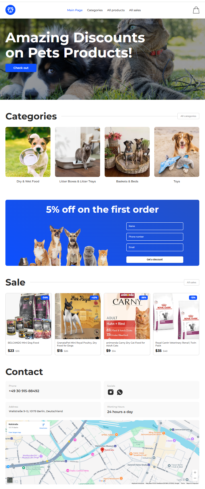
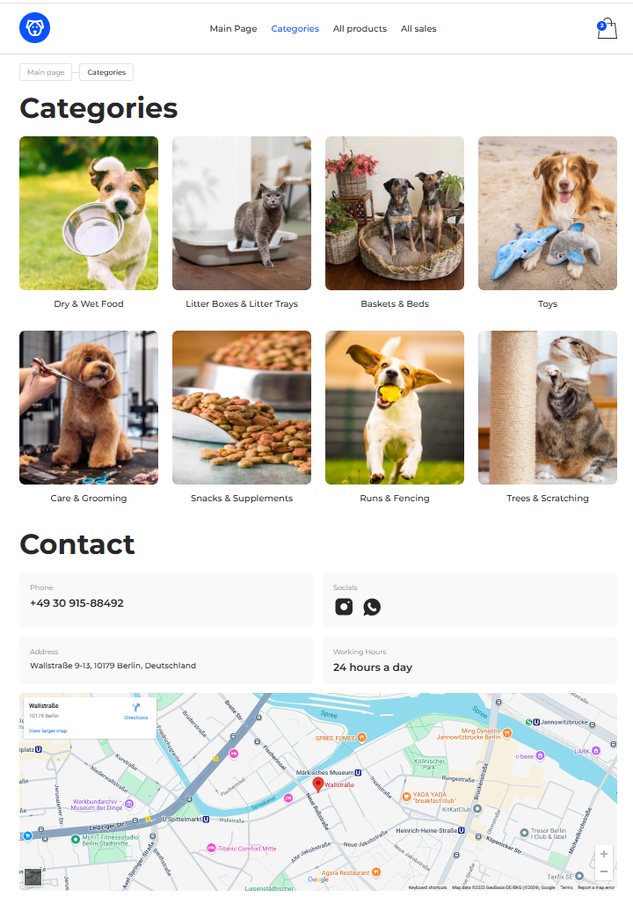

# Pet Shop - E-commerce Project

Это полнофункциональный учебный проект интернет-магазина зоотоваров, созданный с использованием современных технологий веб-разработки. Приложение включает в себя каталог товаров с фильтрацией, страницу товара, корзину и процесс оформления заказа.

**Ссылки на рабочую версию:**
[https://proekt-react-pet-shop.vercel.app/](https://proekt-react-pet-shop.vercel.app/)


---

## 🚀 Основные возможности

* **Каталоги товаров**: Просмотр всех товаров, товаров по категориям и акционных товаров.
* **Динамическая фильтрация и сортировка**: Возможность фильтровать товары по цене, наличию скидки и сортировать по разным критериям.
* **Страница товара**: Детальное описание каждого товара с галереей изображений и возможностью выбора количества.
* **Корзина покупок**: Полнофункциональная корзина с возможностью изменять количество товаров, удалять позиции и видеть итоговую стоимость.
* **Оформление заказа**: Форма для ввода контактных данных с валидацией и отправкой заказа на сервер.
* **Система скидок**: Возможность получить 5% скидку на первый заказ, которая автоматически применяется в корзине.
* **Адаптивный дизайн**: Корректное отображение на всех типах устройств: десктопах, планшетах и мобильных телефонах.

---

## 🛠️ Технологии

### Фронтенд
* **React**: Библиотека для создания пользовательских интерфейсов.
* **Vite**: Сборщик проектов, обеспечивающий быструю разработку.
* **Redux Toolkit**: Для управления глобальным состоянием приложения (корзина, товары, фильтры).
* **React Router DOM**: Для навигации и создания многостраничного приложения.
* **Axios**: Для выполнения HTTP-запросов к бэкенду.
* **React Hook Form**: Для удобной работы с формами и их валидации.
* **CSS Modules**: Для локальной стилизации компонентов.

### Бэкенд
* **Node.js**: Среда выполнения JavaScript на сервере.
* **Express**: Фреймворк для создания веб-сервера и API.
* **SQLite**: Легковесная файловая база данных.

---

## ⚙️ Установка и запуск проекта локально

Чтобы запустить проект на своем компьютере, следуйте этим шагам.

### 1. Установка бэкенда

```bash
# 1. Склонируйте репозиторий
git clone [https://github.com/maxr1977/Proekt_React.git](https://github.com/maxr1977/Proekt_React.git)

# 2. Перейдите в папку с бэкендом
cd Proekt_React/pet-shop-backend

# 3. Установите зависимости
npm install

# 4. Запустите сервер
npm run dev
```
*Бэкенд будет доступен по адресу `http://localhost:3333`.*

### 2. Установка фронтенда

Откройте **новый** терминал.

```bash
# 1. Перейдите в папку с фронтендом
cd Proekt_React/pet-shop

# 2. Установите зависимости
npm install

# 3. Создайте файл .env.development в корне папки pet-shop
# и добавьте в него следующую строку:
VITE_API_BASE_URL=http://localhost:3333

# 4. Запустите приложение для разработки
npm run dev
```
*Фронтенд будет доступен по адресу `http://localhost:5173`.*

---

## 📸 Скриншоты





